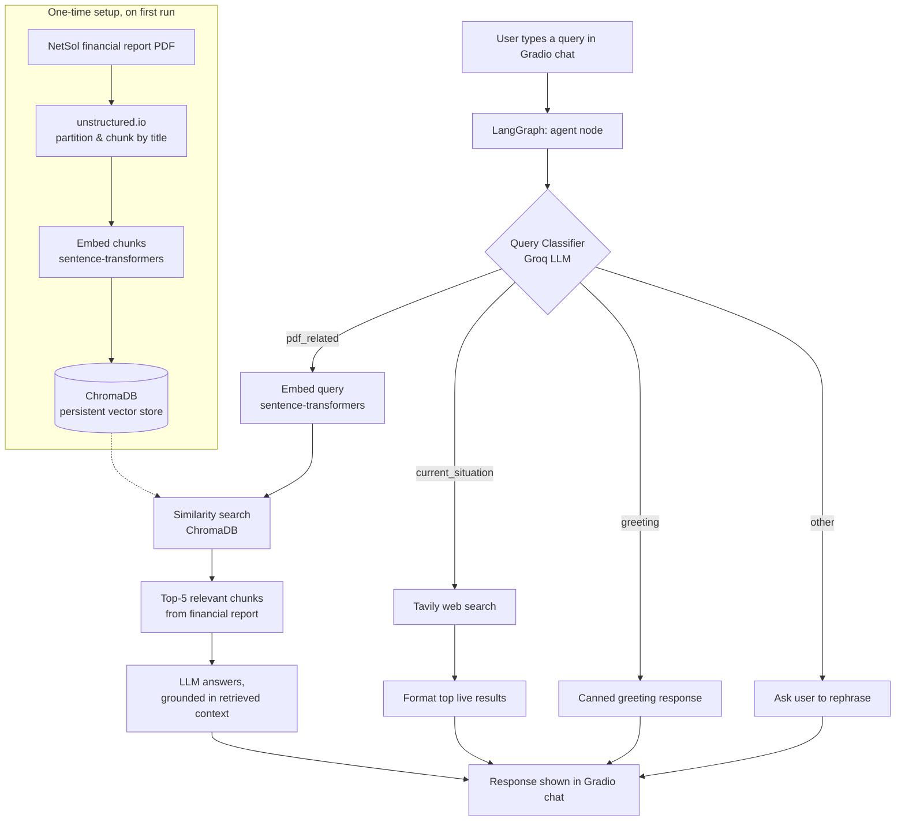

# NetSol RAG Chatbot

An intelligent, multi-source chatbot that answers questions about **NETSOL Technologies' 2024 financial report**, fetches **live web results** for current-events questions, and handles everyday greetings — all from one conversational interface. Built with **LangGraph** for orchestration and **Gradio** for the UI.

This project was built as part of a Retrieval-Augmented Generation (RAG) assignment: ingest a real-world financial PDF, build a retrieval pipeline over it, combine it with live search, and route user queries intelligently between the two.

---

## What this project does

A user types a question into a chat window. Depending on what they ask, the chatbot:

| Question type | Example | What happens |
|---|---|---|
| **Company financials** | "What was NETSOL's revenue in FY2024?" | Retrieves the relevant chunk(s) of the financial report and answers grounded in that text |
| **Current events** | "What's the latest news on NETSOL Technologies?" | Searches the live web via Tavily and returns recent results |
| **Greeting / small talk** | "Hi", "Good morning" | Responds with a friendly canned greeting |
| **Anything else / unclear** | "asdkfj" | Politely asks the user to rephrase |

The chatbot doesn't need the user to specify which "mode" to use — it classifies the query itself and routes it automatically.

## Why this design

A financial report is a **static** document — great for grounded, hallucination-resistant answers via RAG, but it goes stale the moment something changes in the real world (a new quarter, a news event, a stock move). Pure RAG can't answer "what's happening with NETSOL right now?" and pure web search can't reliably quote exact figures from a specific PDF. So this project combines both:

- **RAG (ChromaDB + embeddings)** for grounded, accurate answers from the report itself
- **Live web search (Tavily)** for anything time-sensitive that the static report can't cover
- **An LLM-based router** so the user never has to think about which one to use

## Architecture

## How it works, step by step

**1. Ingestion (runs once, on first launch)**
The NetSol financial report PDF is parsed with [`unstructured.io`](https://unstructured.io/), which splits it into clean text chunks grouped by section/title (`chunking_strategy="by_title"`). Each chunk is turned into a vector embedding using the `all-MiniLM-L6-v2` sentence-transformers model, and all chunks + embeddings are stored in a local, persistent **ChromaDB** collection. On every later run, this step is skipped if the collection already has data — so startup is instant after the first run.

**2. Query classification**
Every message the user sends first goes through a classification prompt sent to a **Groq**-hosted LLM. It labels the query as one of:
- `pdf_related` — about NETSOL's financials, certifications, or company details
- `current_situation` — news / recent updates about the company
- `greeting` — casual hello-type messages
- `other` — anything vague or unrelated

**3. Routing (LangGraph)**
The classification decides which path the query takes. This is wired together as a small **LangGraph** graph — the `agent` node runs the classifier internally and dispatches to the right handler function, then returns a single response message.

**4. Answering**
- **`pdf_related`** → the query is embedded and matched against the ChromaDB collection (top-5 nearest chunks). Those chunks are passed to the LLM as context, and it answers *grounded in that text* — reducing hallucination compared to answering from the model's own memory.
- **`current_situation`** → the raw query is sent to **Tavily's** search API, and the top results (title, URL, short snippet) are formatted and returned.
- **`greeting`** → a fixed friendly response, no LLM call needed.
- **`other`** → the bot asks the user to rephrase rather than guessing.

**5. UI**
Everything is served through a **Gradio** `Chatbot` component with a custom dark theme — a simple textbox in, formatted chat bubbles out, with a "Clear Chat" button to reset the conversation.
