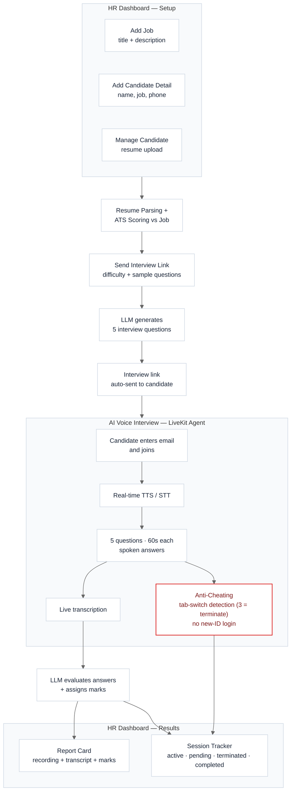

# Recument AI — AI Recruitment Pipeline

An end-to-end AI-powered recruitment platform that takes a candidate from resume submission to a fully evaluated, AI-conducted voice interview — with an HR dashboard tying every stage together. Built with a **FastAPI** backend, **LiveKit**-powered real-time voice interview agent, and a **Next.js** frontend.

---

## What this project does

An HR user manages the entire hiring pipeline from one dashboard with six core functions:

| Function | What it does |
|---|---|
| **Add Job** | Add a job title and job description |
| **Add Candidate Detail** | Add candidate name, the job they're applying for, and phone number |
| **Manage Candidate** | Upload the candidate's resume — automatically parsed and ATS-scored against the job |
| **Send Interview Link** | Pick a candidate + job, set question difficulty (easy/medium/hard) with sample questions, and auto-send the interview link |
| **Report Card** | View the screen recording, transcript, and LLM-evaluated marks for each candidate's completed interview |
| **Session** | Track every interview session's status — active, pending, terminated, or completed |

On the candidate side, once they receive the link, they join a live AI-conducted voice interview: an agent asks 5 questions generated for that specific role and difficulty, the candidate answers out loud within a time limit, and their responses are transcribed and scored — no human interviewer needed for this first round.

## Why this design

Early-stage recruitment is high-volume and repetitive: dozens or hundreds of resumes for a single role, most needing a first-pass filter before a human should spend time on them, followed by a first-round interview that's largely the same set of questions for every candidate in that role. Manually screening resumes and conducting first interviews for every candidate doesn't scale. This project splits the pipeline into two kinds of work:

- **Automatable, high-volume steps** — resume parsing, ATS scoring, question generation, conducting the interview, transcription, and scoring — all handled by AI (Groq-hosted LLM + LiveKit for real-time voice)
- **Judgment-based steps** — deciding which jobs to post, which candidates to add, what difficulty/topics an interview should cover, and reviewing final report cards — left to HR via the dashboard

The result: HR still drives every decision that matters, but doesn't have to manually do the mechanical, repetitive parts of a first-round screen.

## Architecture

## How it works, step by step

**1. Add Job**
HR creates a job opening with a title and description. This becomes the benchmark every candidate for that role is scored against, and the context the LLM uses later when generating interview questions.

**2. Add Candidate Detail**
HR adds the candidate's name, links them to a specific job, and records their phone number.

**3. Manage Candidate**
HR uploads the candidate's resume. The backend automatically parses it into structured data and ATS-scores it against the linked job's requirements, giving HR an objective view of fit before deciding whether to move the candidate forward.

**4. Send Interview Link**
HR selects the candidate and job, chooses a difficulty level (easy/medium/hard), and provides sample questions as a guide. An LLM uses the job, difficulty, and samples to generate the actual set of interview questions for that candidate, and the system automatically emails/sends the interview link.

**5. AI voice interview (candidate side)**
The candidate opens the link, enters their email, and joins. A **LiveKit**-powered agent handles the interview in real time:
- Text-to-speech (TTS) reads out each question; speech-to-text (STT) captures the candidate's spoken answer
- **5 questions** are asked, generated specifically for that candidate's role and difficulty
- Each question has a **60-second** time limit to answer
- **Anti-cheating measures**: switching browser tabs is detected, and the interview auto-terminates after the **3rd tab switch**; the system also blocks the candidate from logging in under a different/new ID mid-interview
- Each spoken answer is transcribed as the interview progresses

**6. Evaluation and Report Card**
After the interview, an LLM evaluates the candidate's transcribed answers and assigns marks. HR can then open the **Report Card** for that candidate to review the screen recording, full transcript, and the LLM-assigned score, in one place.

**7. Session tracking**
Every interview run is tracked as a session with a status — **active** (in progress), **pending** (link sent, not yet started), **terminated** (ended early, e.g. due to tab-switch violations), or **completed** — so HR always has visibility into where every candidate stands.
